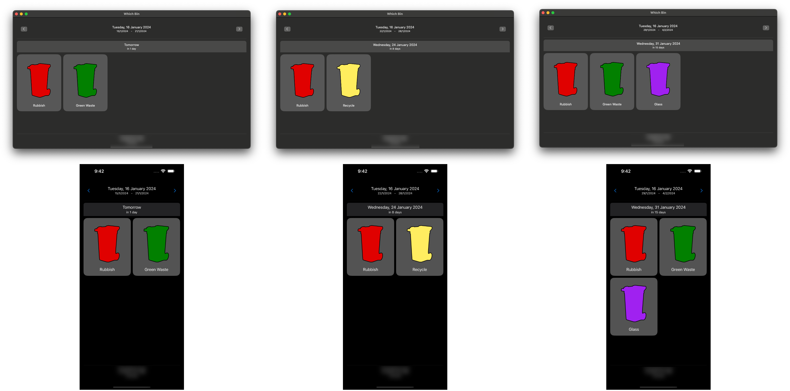

  

# Which Bin

If you’re rubbish collection is anything like mine, you will have multiple bins, each with its own individual schedule of when it needs to be put out.

At some point, it all just got a little bit crazy.

After some research I found that my local council maintained a “dataset” which provided the rules for an algorithm which could calculate the schedule for each bin and could do so based on a geo location!

Which Bin was born!

# Experimentation

As with most things, the best way to learn something (at least in software development) is to try and solve a real-world problem. Which Bin is just that, it’s an experiment which attempts to solve a real-world problem.

This problem allows me the opportunity to experiment with SwiftUI.  It’s a multi-platform app, so it can run on both macOS and iOS.

# Multiplatform

While initially, this is looking okay, I would argue that the navigation title on MacOS is a little underwhelming.  Something to look into.

# What it doesn’t do…

Realistically, the way to solve this problem would be to have a web service, which, based on the user’s geo location, could determine which “local government area” the user was in and return the “collection feature” information they would need to calculate the “events”.

Since this wasn’t the point of this exercise, I’m instead, downloading the raw data set from my local council and parsing it locally instead.

The geo-location is also hard coded.  I’ve gone through some thought process about how to introduce CoreLocation into the app and I believe that this would be a future feature, whereby a user could define one or more locations of interest (because my mum can’t work out this schedule either).

# Future improvements

## Widgets!

Because that would actually be massively useful for presenting glancable data!

## Make use of `NavigationLink`

Do people really care about previous weeks?  If not, making use of `NavigationLink` might provide a better UX.

## User definable locations

As already discussed, it would be nice to allow the user to configure one or more locations they want to use.  This could make use of CoreLocation to find the user’s current location or allow some kind of geo-look up based on an inputted address.

But since the app is restricted to a single “local government area”, it’s immediate use would be limited.

## Allow users to link to their local government area dataset.

Nice idea, can’t see many users doing that, maybe build a small list of areas around family and friends they could pick from?  This is starting to move towards a “web service” requirement.

## Better configuration for bin colors

Because standardisation is to hard.
